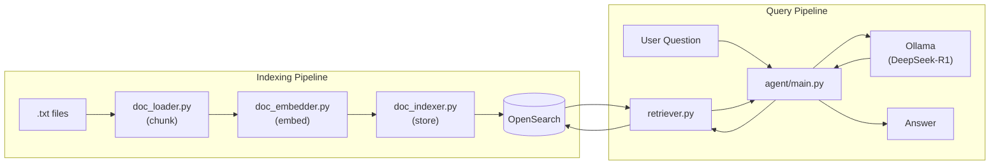

# Synthetix AIDEA-B

A **RAG (Retrieval-Augmented Generation)** application that ingests `.txt` documents, embeds and indexes them in OpenSearch, and answers questions using a local DeepSeek-R1 model served via Ollama.

## Pipelines

| Pipeline | Entry Point | Purpose |
|---|---|---|
| **Indexing** | `src/service/main.py` | Loads `.txt` files → chunks them → embeds with `all-MiniLM-L6-v2` → stores in OpenSearch |
| **Agent** | `src/agent/main.py` | Takes a user question → retrieves relevant chunks → feeds to DeepSeek-R1 via Ollama |

## Architecture



## Infrastructure

Managed via `docker-compose.yml`:

| Service | Description |
|---|---|
| **Ollama** | Serves the DeepSeek-R1 1.5B model locally (port `11434`) |
| **Model Puller** | One-shot init container that pre-pulls the model, then exits |
| **OpenSearch** | Vector store for document embeddings (port `9200`) |
| **OpenSearch Dashboards** | Optional UI for inspecting indexes (port `5601`) |

## Getting Started

1. **Start the infrastructure:**
   ```bash
   docker compose up -d
   ```

2. **Install Python dependencies:**
   ```bash
   pip install -r requirements.txt
   ```

3. **Index your documents** — place `.txt` files in `data/txt/`, then:
   ```bash
   cd src/service
   python main.py
   ```

4. **Ask questions:**
   ```bash
   cd src/agent
   python main.py
   ```
